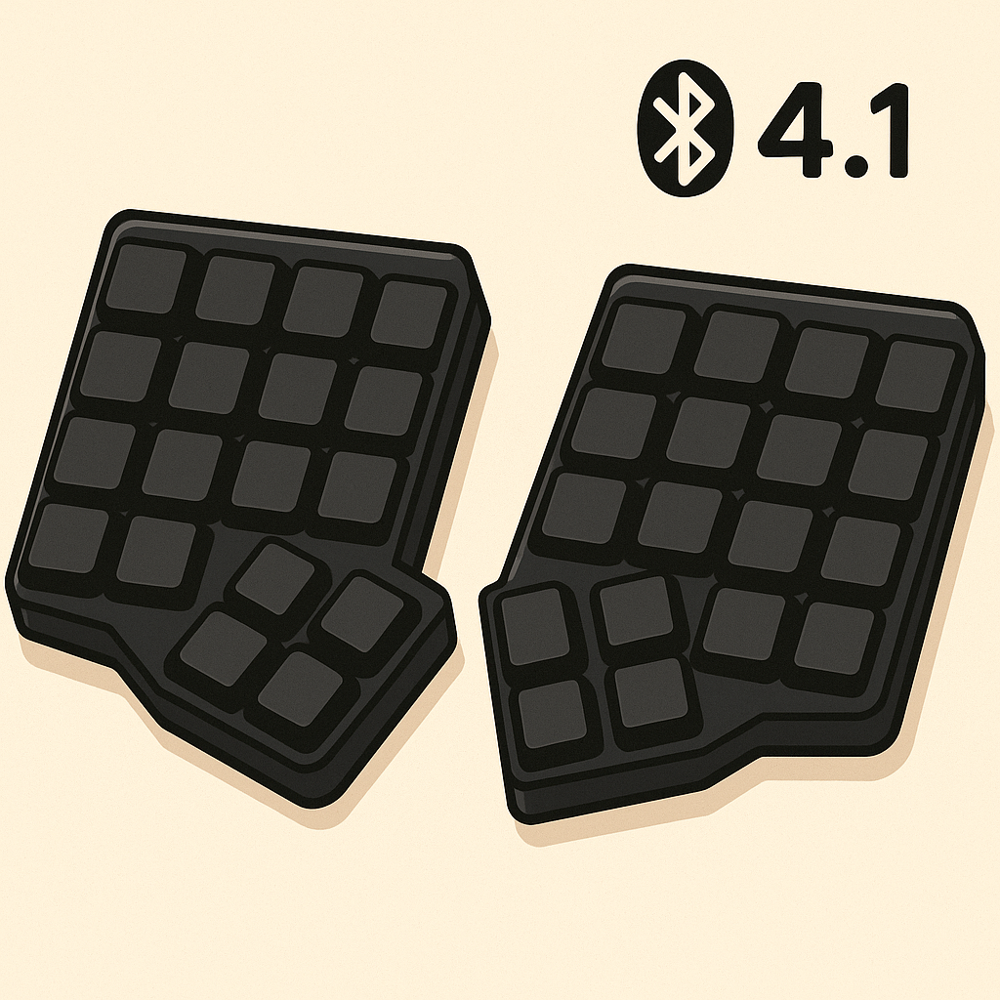

# Corne Keyboard Configuration

This repository contains my personal configuration for the Corne (CRKBD) split keyboard.

## Hardware

- **Keyboard**: Corne v4.1 wireless (CRKBD)
- **Switches**: Kailh v2 choc (low-profile)
- **Layout**: 42-key split ergonomic design

## Files

- `corne-120725.vil` - Current Vial configuration file (July 12, 2025)
- `corne.json` - JSON export of the current layout
- `corne-110725.vil` - Previous Vial configuration (July 11, 2025)
- `corne-070825.vil` - Previous Vial configuration (July 8, 2025)

## Layout History

This repository will maintain the last 5 layout configurations for easy rollback and comparison:
- Latest configurations are kept with date stamps
- Previous versions help track layout evolution
- Easy to revert to a working configuration if needed

## Setup

1. Install [Vial](https://get.vial.today/)
2. Connect your Corne keyboard (via USB or pair wirelessly)
3. Load the latest `.vil` file in Vial to apply the configuration

## Features

This configuration includes:
- Custom key layouts across multiple layers
- Macros for common shortcuts and workflows
- Tap dance and combo keys for enhanced functionality
- Key overrides optimized for the 42-key layout
- Wireless-friendly power management considerations

## Future Implementations

Planned enhancements for this repository:

- **Layout Visualizer**: Generate visual representations of keyboard layouts using keymap-drawer
- **Automated Layout Comparison**: Scripts to compare different configuration versions
- **Layer Analysis**: Tools to analyze key frequency and layer usage patterns

## About the Corne

The Corne (CRKBD) is a 42-key split ergonomic keyboard designed for comfort and efficiency. The v4.1 wireless version offers the convenience of wireless connectivity while maintaining the compact, ergonomic design that makes the Corne popular among enthusiasts. 